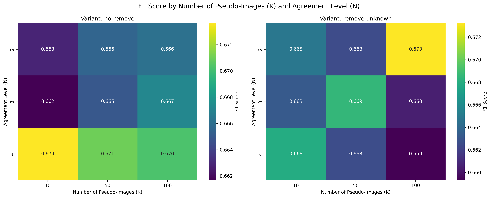
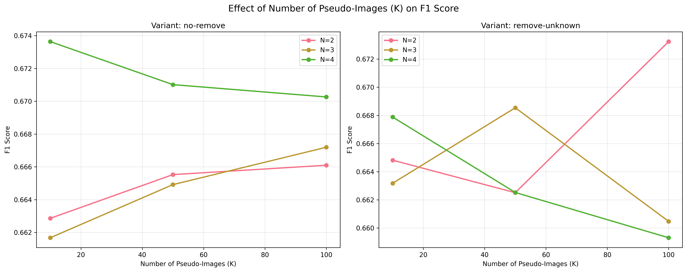

# Semantic Segmentation Benchmark — Semi-Supervised Satellite Imagery 🛰️

> Exploring semi-supervised learning for **semantic segmentation of satellite data**.  
> Benchmarks include U-Net, DeepLabV3, YOLO-Seg, and Random Forest models under a **pseudo-labeling pipeline**.

---

## 🔥 Highlights
- **Multiple model families** benchmarked under the same training/eval protocol.  
- **Semi-supervised pipeline** with pseudo-label generation, consensus filtering, and retraining.  
- **Reproducible experiments** 
- Results reported with **F1 score** under varying parameters.

---

## 📊 Results

We investigate the effect of:
- **K** = number of pseudo-labeled images added, and  
- **N** = agreement level between models for accepting a pseudo-label,  

under two variants: **no-remove** (all pseudo-labels kept) and **remove-unknown** (filter uncertain pixels).

### Heatmaps — F1 by K and N

<p align="center">

</p>

**Conclusion:**  
- With *no-remove*, higher agreement (N=4) yields the best F1 (0.674).  
- With *remove-unknown*, F1 peaks at K=100, N=2 (0.673), though performance is more volatile.  
- Gains over supervised-only baseline (~0.660 F1) are modest but consistent.

---

### Line plots — Effect of K on F1

<p align="center">

</p>

**Conclusions:**  
- Increasing K does not guarantee improvement; the effect depends on agreement level (N).  
- Best trade-offs occur at small K with stricter agreement (N=4).  
- Variants diverge: *no-remove* is stable with N=4, while *remove-unknown* favors low agreement and high K.

---

## 🚀 Quickstart

```bash
# 1. Clone & env
git clone https://github.com/aggelosntou/semantic-segmentation-benchmark.git
cd semantic-segmentation-benchmark
pip install -r requirements.txt

# 2. Train (example: U-Net)
python models/unet_no_patches/train.py

# 3. Evaluate
python models/deeplab/eval.py
